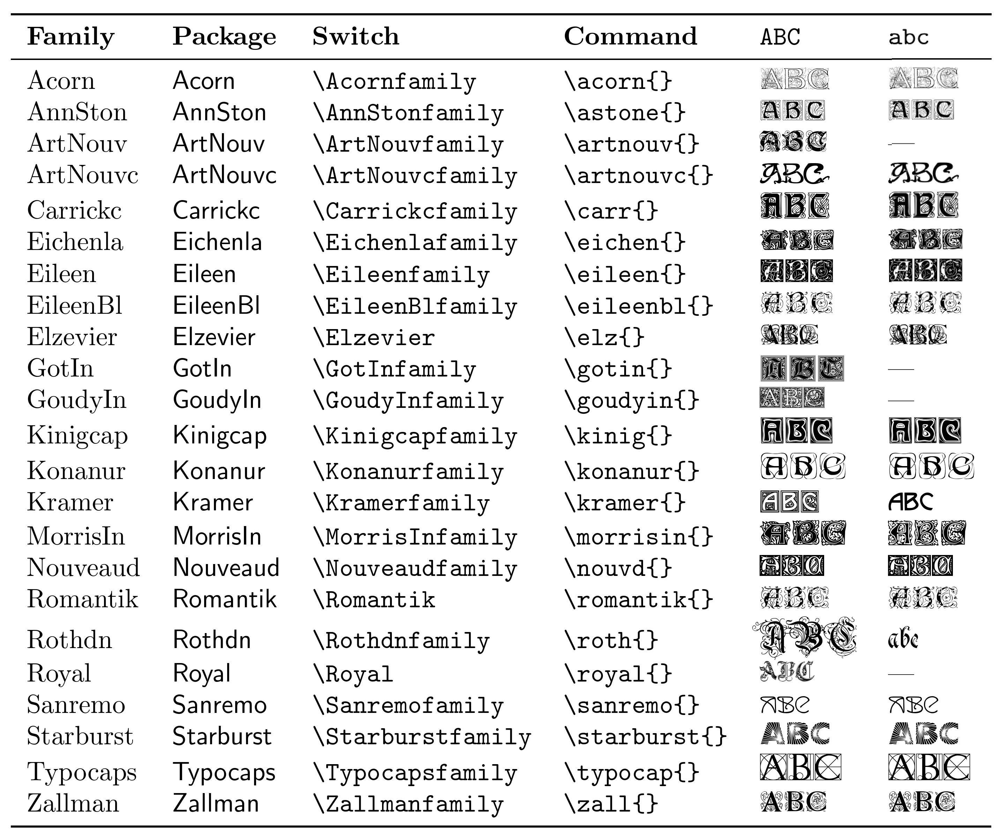
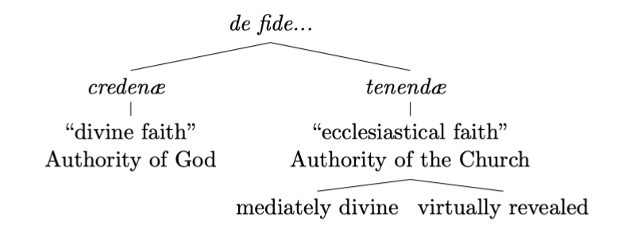

# LaTeX-Cheatsheet

Collection of links, articles, tricks and snippets for making LaTeX documents.

## Posts/Articles

- [Set Initial Fonts](https://tex.stackexchange.com/a/250479/254874)
- [Scale the Document](https://tex.stackexchange.com/a/70240/254874)
- [Samples of Custom Chapters](http://zoonek.free.fr/LaTeX/LaTeX_samples_chapter/0.html)

## Snippets

#### Scale the Document's Fonts

```LaTeX
\usepackage{relscale}
\relscale{0.95} % or whatever scaling is desired
```

#### Set font for initials

```LaTeX
\usepackage{Carrickc,lettrine}
\renewcommand\LettrineFontHook{\Carrickcfamily}
```


#### Linebreaks with Tikz Trees

```LaTeX
\begin{tikzpicture}
    \tikzset{every tree node/.style={align=center}}
    {
	\Tree [.{\textit{de fide...}} 
		[.{\textit{creden\ae\ }} 
		[.{``divine faith''\\ Authority of God} ]
	]
		[.{\textit{tenend\ae\ }} 
			[.{``ecclesiastical faith''\\ Authority of the Church} 
				[.{mediately divine} ]
				[.{virtually revealed} ]
			]
		]
	]
	}
\end{tikzpicture}
```


## Tricks

#### Symmetrical dots using `\dotfill`.

Add before `\begin{document}`:

```LaTeX
\makeatletter
\renewcommand \dotfill {\leavevmode \leaders \hb@xt@ .44em{\hss .\hss }\hfill \kern \z@}
\makeatother
```
